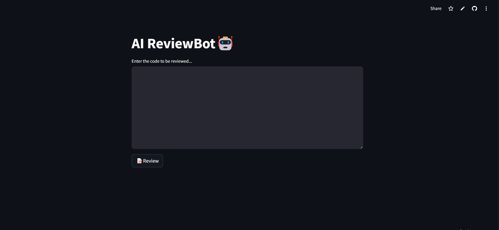

# AI ReviewBot🤖
AI Reviewbot using gemini

---
🔗 Live Application URL: (https://ai-codereviewerb.streamlit.app/)

[](https://ai-codereviewerb.streamlit.app/)

## 🚀 Overview
The **AI-CodeReviwer** is an AI-powered tool that helps developers review their code using Google's **Gemini (Google Generative AI)**. It provides intelligent feedback, suggests optimizations, and detects potential issues in the code.

## 🛠 Features
- 🔍 **Automated Code Review** – AI-based analysis of code quality, syntax, and best practices.
- 💡 **Optimization Suggestions** – Get AI-powered recommendations for improving efficiency.
- 🛠 **Error Detection** – Identify and resolve common coding errors.
- 🌍 **Supports Multiple Languages** – Works with Python, Java, JavaScript, and more.
- 🎨 **Streamlit UI** – Simple and interactive interface for reviewing code.

---

##  Installation & Setup

### **1️⃣ Clone the Repository**
```bash
git clone https://github.com/damamrajeswari/AI-CodeReviewer.git
cd AI-CodeReviewer
```

### **2️⃣ Install Dependencies**

```bash
pip install -r requirements.txt
```

### **3️⃣ Run the Application**
```bash
streamlit run app.py
```

---

## 📂 Project Structure
```
AI-CodeReviewer/
│── app.py                # Main Streamlit application
│── requirements.txt      # Python dependencies
│── README.md             # Project documentation
```

---

## 🧠 How It Works
1. **Type or Paste Code** – Input your code into the Streamlit UI.
2. **AI Analysis** – The AI model (Google Gemini) reviews the code.
3. **Receive Feedback** – Get detailed insights and suggestions.
4. **Optimize Code** – Implement AI-recommended improvements.


---

## 🤖 Tech Stack
- **Frontend**: Streamlit (Python UI Framework)
- **AI Model**: Google Gemini API (Google Generative AI)
- **Backend**: Python
- **Libraries**: `streamlit`, `google-generativeai`

---


## 📩 Contact & Contributions
📧 **Contact**: rajeswaridamam007@gmail.com
💡 **Contribute**: Feel free to submit issues or pull requests!

---

### 🎯 Happy Learning and Exploring🚀

